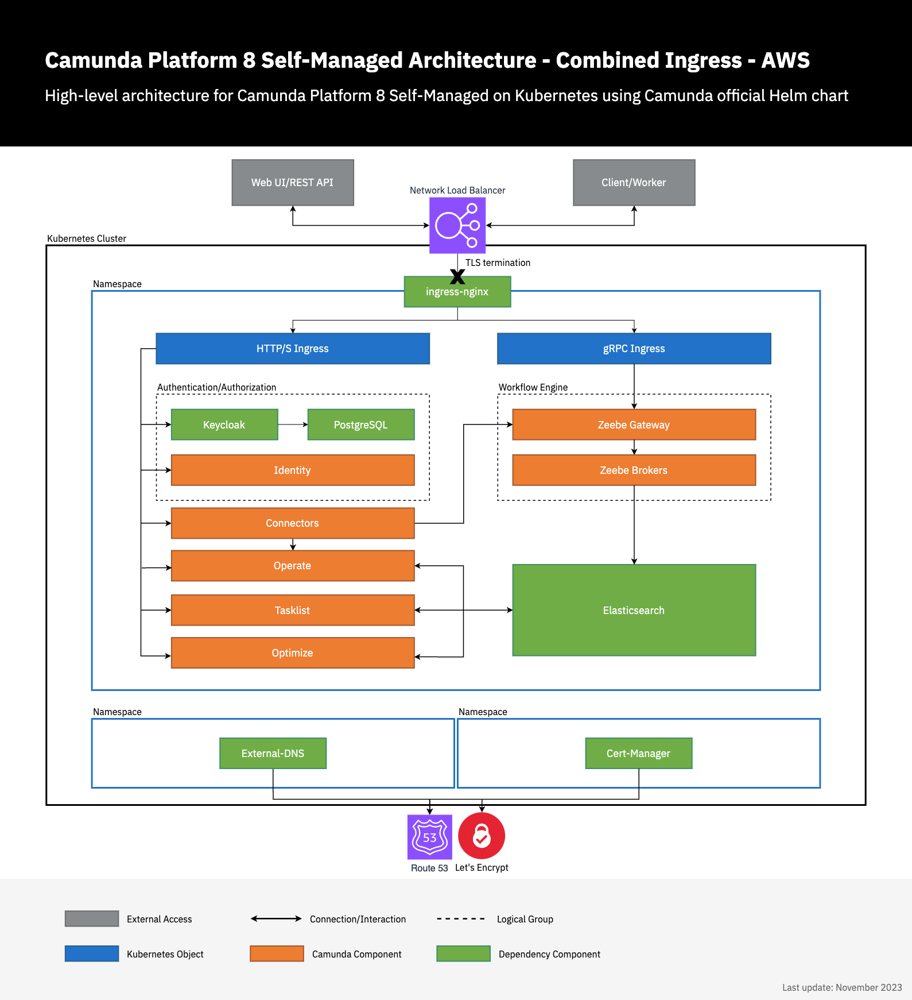

## Prerequisites

- a Kubernetes Cluster, see [eksctl](#) or [terraform](#) guide <!-- TODO: replace with proper links -->
- [Helm (3.13.1)](https://helm.sh/docs/intro/install/) installed
- [kubectl (1.28.x)](https://kubernetes.io/docs/tasks/tools/#kubectl) to interact with the cluster.

## Considerations

### Architecture



## Usage

### Environment Prerequisites

In order to streamline the execution of the subsequent commands, it is recommended to export multiple environment variables.

The following are the required environment variables with some example values.

```shell
# Your standard region that you host AWS resources in
export REGION=eu-central-1
# The domain name that you intend to use
export DOMAIN_NAME=camunda.example.com
# The e-mail to register with Let's Encrypt
export MAIL=admin@camunda.example.com
```

Additionally, please follow the guide from either [eksctl](#) or from [Terraform](#) to retrieve the following values, which will be required for subsequent steps. <!-- TODO: Link to sources -->

- EXTERNAL_DNS_IRSA_ARN
- CERT_MANAGER_IRSA_ARN
- DB_HOST
- PG_USERNAME
- PG_PASSWORD
- DEFAULT_DB_NAME
- REGION

### DNS Setup

#### ingress-nginx

Ingress-nginx is an open-source Kubernetes Ingress controller that provides a way to manage external access to services within a Kubernetes cluster. It acts as a reverse proxy and load balancer, routing incoming traffic to the appropriate services based on rules defined in the Ingress resource.

The following will install `ingress-nginx` in the `ingress-nginx` namespace via Helm. For more configuration options, conduct the [Helm chart](https://github.com/kubernetes/ingress-nginx/tree/main/charts/ingress-nginx).

```shell
helm upgrade --install \
  ingress-nginx ingress-nginx \
  --repo https://kubernetes.github.io/ingress-nginx \
  --set 'controller.service.annotations.service\.beta\.kubernetes\.io\/aws-load-balancer-backend-protocol=tcp' \
  --set 'controller.service.annotations.service\.beta\.kubernetes\.io\/aws-load-balancer-cross-zone-load-balancing-enabled=true' \
  --set 'controller.service.annotations.service\.beta\.kubernetes\.io\/aws-load-balancer-type=nlb' \
  --namespace ingress-nginx --create-namespace
```

#### external-dns

External-dns is a Kubernetes add-on that automates the management of DNS records for external resources, such as Load Balancers or Ingress controllers. It monitors the Kubernetes resources and dynamically updates the DNS provider with the appropriate DNS records.

The following will install `external-dns` in the `external-dns` namespace via Helm. For more configuration options, conduct the [Helm chart](https://github.com/kubernetes-sigs/external-dns/tree/master/charts/external-dns).

Consider setting `domainFilters` via `--set` to restrict access to certain hosted zones.

```shell
helm upgrade --install \
  external-dns external-dns \
  --repo https://kubernetes-sigs.github.io/external-dns/ \
  --set "env[0].name=AWS_DEFAULT_REGION" \
  --set "env[0].value=$REGION" \
  --set txtOwnerId=external-dns \
  --set policy=sync \
  --set "serviceAccount.annotations.eks\.amazonaws\.com\/role-arn=$EXTERNAL_DNS_IRSA_ARN" \
  --namespace external-dns \
  --create-namespace
```

#### cert-manager

Cert-manager is an open-source Kubernetes add-on that automates the management and issuance of TLS certificates. It integrates with various certificate authorities (CAs) and provides a straightforward way to obtain, renew, and manage SSL/TLS certificates for your Kubernetes applications.

The following will install `cert-manager` in the `cert-manager` namespace via Helm. For more configuration options, conduct the [Helm chart](https://artifacthub.io/packages/helm/cert-manager/cert-manager). The supplied settings will also configure `cert-manager` to ease the certificate creation by setting a default issuer, which allows us to add a single annotation on an ingress to request the relevant certificates.

```shell
helm upgrade --install \
  cert-manager cert-manager \
  --repo https://charts.jetstack.io \
  --namespace cert-manager \
  --create-namespace \
  --set installCRDs=true \
  --set "serviceAccount.annotations.eks\.amazonaws\.com\/role-arn=$CERT_MANAGER_IRSA_ARN" \
  --set securityContext.fsGroup=1001 \
  --set ingressShim.defaultIssuerName=letsencrypt-production \
  --set ingressShim.defaultIssuerKind=ClusterIssuer \
  --set ingressShim.defaultIssuerGroup=cert-manager.io
```

It is recommended to install the cert-manager custom resource definitions (CRDs) separately from Helm. Please refer to the [installation advice](https://cert-manager.io/docs/installation/helm/#crd-installation-advice) provided by cert-manager. This approach is recommended because when using Helm, there is a possibility of accidentally omitting the CRDs due to incorrect configuration resulting the loss of certificates.

Create a ClusterIssuer via `kubectl` to enable cert-manager to request certificates from [Let's Encrypt](https://letsencrypt.org/).

```shell
cat << EOF | kubectl apply -f -
---
apiVersion: cert-manager.io/v1
kind: ClusterIssuer
metadata:
  name: letsencrypt-production
spec:
  acme:
    server: https://acme-v02.api.letsencrypt.org/directory
    email: $MAIL
    privateKeySecretRef:
      name: letsencrypt-production-issuer-account-key
    solvers:
      - selector: {}
        dns01:
          route53:
            region: $REGION
            # Cert-manager will automatically observe the hosted zones
            # Cert-manager will automatically make use of the IRSA assigned service account
EOF
```

### Camunda 8

The following makes use of the [combined ingress setup](../../guides/ingress-setup.md#combined-ingress-setup) by deploying a single ingress for all HTTP components and a separate ingress for the gRPC endpoint.

Furthermore, we leverage the managed Postgres DB created earlier for KeyCloak.

For more configuration options, refer to the [Helm Chart documentation](https://github.com/camunda/camunda-platform-helm/blob/main/charts/camunda-platform/README.md). Additionally, explore our existing resources on the [C8 Helm Chart](../../deploy.md) and [guides](../../guides/).

```shell
helm upgrade --install \
  camunda camunda-platform \
  --repo https://helm.camunda.io \
  --namespace camunda \
  --create-namespace \
  --set identity.keycloak.postgresql.enabled=false \
  --set identity.keycloak.externalDatabase.host=$DB_HOST \
  --set identity.keycloak.externalDatabase.user=$PG_USERNAME \
  --set identity.keycloak.externalDatabase.password=$PG_PASSWORD \
  --set identity.keycloak.externalDatabase.database=$DEFAULT_DB_NAME \
  --set global.ingress.enabled=true \
  --set global.ingress.host=$DOMAIN_NAME \
  --set global.ingress.tls.enabled=true \
  --set global.ingress.tls.secretName=camunda-c8-tls \
  --set-string 'global.ingress.annotations.kubernetes\.io\/tls-acme=true' \
  --set global.identity.auth.publicIssuerUrl="https://$DOMAIN_NAME/auth/realms/camunda-platform" \
  --set global.identity.auth.operate.redirectUrl="https://$DOMAIN_NAME/operate" \
  --set global.identity.auth.tasklist.redirectUrl="https://$DOMAIN_NAME/tasklist" \
  --set global.identity.auth.optimize.redirectUrl="https://$DOMAIN_NAME/optimize" \
  --set identity.contextPath="/identity" \
  --set identity.fullURL="https://$DOMAIN_NAME/identity" \
  --set operate.contextPath="/operate" \
  --set tasklist.contextPath="/tasklist" \
  --set optimize.contextPath="/optimize" \
  --set zeebe-gateway.ingress.enabled=true \
  --set zeebe-gateway.ingress.host="zeebe.$DOMAIN_NAME" \
  --set zeebe-gateway.ingress.tls.enabled=true \
  --set zeebe-gateway.ingress.tls.secretName=zeebe-c8-tls \
  --set-string 'zeebe-gateway.ingress.annotations.kubernetes\.io\/tls-acme=true'
```

With the C8 Helm chart deployed, consider continuing your journey by [interacting with the zeebe-gateway](https://docs.camunda.io/docs/self-managed/zeebe-deployment/security/client-authorization/).

### Advanced topics

The following are some suggestions that one can continue further with to improve the cluster setup.

- [Cluster Autoscaling](https://github.com/kubernetes/autoscaler/blob/master/cluster-autoscaler/cloudprovider/aws/README.md)
